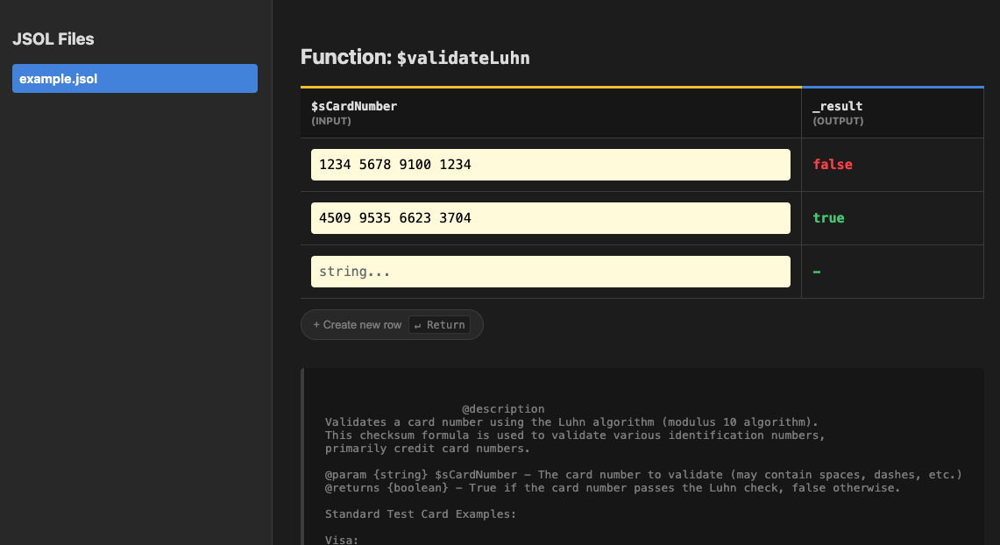

# JSOL: JavaScript Source Of Logic
2026, [Santiago Bustelo](https://www.bustelo.com.ar/) • MIT License

**An isomorphic business-logic standard for zero-dependency ecosystems.**

Version: v0.2.95 • 2026-08-20


## Quick start

JSOL compilers transpile a source '.jsol' file into target languages ('.js', '.php', '.ts', and '.py'). By default, it generates all available targets simultaneously, but you can filter them using the '--targets' flag.

Compile to ALL targets simultaneously:
```bash
# Using the Node.js compiler host
node jsol-compiler-node/index.js --source="./my-file.jsol" --out-dir="./out"

# Using the PHP compiler host
php jsol-compiler-php/index.php --source="./my-file.jsol" --out-dir="./out"

# Using the Python compiler host
python3 jsol-compiler-py/index.py --source="./my-file.jsol" --out-dir="./out"
```

Compile ONLY to specific targets (e.g., JavaScript, PHP, TypeScript, Python):

```bash
# Using the Node.js compiler host
node jsol-compiler-node/index.js --source="./my-file.jsol" --out-dir="./out" --targets="js,php,ts,py"

# Using the PHP compiler host
php jsol-compiler-php/index.php --source="./my-file.jsol" --out-dir="./out" --targets="js,php,ts,py"

# Using the Python compiler host
python3 jsol-compiler-py/index.py --source="./my-file.jsol" --out-dir="./out" --targets="js,php,ts,py"
```

Both host CLI tools accept the same flags and generate identical outputs in the target directory.

### Consuming & Validating TypeScript

There is no separate 'jsol-compiler-ts' binary. The Node and PHP host compilers emit the '.ts' files directly, annotated according to the JSOL Type Prefix Matrix. 

To verify that the generated TypeScript output complies strictly with your project's 'tsc' configuration without errors:

```bash
npx tsc --noEmit --skipLibCheck ./out/*.ts
```

Full setup instructions per distribution are available in [docs/01_GETTING_STARTED.md](docs/01_GETTING_STARTED.md).


**Live demo:** https://jsol.bustelo.com.ar/ — try the interactive REPL and explore the example library.


## What is JSOL?

Over a decade ago, Douglas Crockford took JavaScript, amputated all executable code from it, and gave us **JSON**: the de facto standard for transporting *data*.

**JSOL** does the inverse. It takes JavaScript, amputates access to the host environment (DOM, window, I/O), and restricts its syntax to a strict, C-style subset, to give us a universal format for *business logic*.

JSOL lets you write complex mathematical and procedural rules once, run them natively in the browser, and transpile them to other languages for the backend. Driven by a Single Source of Truth (SSOT) and an AST-free compiler architecture, it ensures absolute mathematical convergence and zero-dead-code execution across different programming environments. It's the missing link for isomorphism in lightweight frameworks.

**Supported Targets:**
* **JavaScript:** Pure, GC-reliant output ready for Node.js or any Browser environment.
* **PHP:** Native associative arrays and closures, ready for CLI or Web SAPI with zero external dependencies.
* **TypeScript:** Strictly typed output matching the JSOL Type Prefix Matrix, ensuring zero errors under strict compilation.
* **Python:** Native Python 3 output with 100% isomorphic parity, dynamic loop unrolling and structured indentation.

Extending this is part of the [vision and call for support](docs/ROADMAP.md).

*(For a detailed log of all changes, features, and architectural updates, see [docs/20_product/version_history.md](docs/20_product/version_history.md)).*


## What's New (v0.2.9 series)

- Pure JSOL Thompson VM Regex Engine integrated.
- Domain namespaces ('Str.*', 'Arr.*', 'Map.*', 'Math.*', 'Bit.*', 'Cast.*') active.
- Fixed-point convergence verified across JS and PHP hosts.
- Interactive Visual REPL Interpreter (`interpreter/`) introduced.

## Why JSOL exists

JSOL was born out of a real requirement in [IPAX](https://ipax.bustelo.com.ar), a color-accessibility engine doing intensive math (OKLCH conversions, APCA/WCAG contrast, physiological vision modeling) that has to run instantly in the browser and be re-validated, with the exact same results, on the server. Hand-maintaining two parallel implementations guarantees drift and bugs. JSOL is the alternative to that: one file, two native targets, guaranteed parity.

It was built inside **j0**, a zero-config, zero-binary-dependency PHP/JS framework. That constraint ruled out the standard industrial answers (see [docs/20_product/COMPARISON.md](docs/20_product/COMPARISON.md) for why Haxe, WebAssembly, and JSON-driven math were each considered and rejected). The answer that fit was a JS subset trivial enough to convert to other C-like languages with regular expressions and a small hand-written lexer.


## Design Pillars

Four principles shape every rule in the specification. When two of them pull in different directions, this is the order that decides:

1. **Clarity** — a JSOL algorithm has to be readable by the person who owns the business logic, not just by a compiler. When a portability rule would force an algorithm into an unreadable shape, the rule loses, not the readability. This is also why JSOL doesn't standardize *how* you structure code (nested functions vs. flat scope, for instance) — that's implementation shape, not business logic, and JSOL only prescribes what changes the actual numbers a program produces.
2. **Portability** — the same source runs correctly on every proven target. This is where Deterministic Parity comes from: given identical inputs, every target's output has to match, bit for bit.
3. **Performance** — the compiled output should be no heavier and no slower than it has to be. This is where Zero Dead Code comes from: nothing gets shipped that a given file doesn't actually use.
4. **Developer Experience** — writing, compiling, and debugging JSOL should be as frictionless as the constraints allow. This is where the AST-free compiler pipeline comes from (fast, small, easy to embed in an existing build, easy to reason about), and where Zero Runtime Dependencies comes from (no toolchain to install before you can start).

Full detail, with the reasoning behind each derived rule, in [docs/02_LANGUAGE_SPEC_CURRENT.md](docs/02_LANGUAGE_SPEC_CURRENT.md) Section 1.

## Use Cases

JSOL fits any scenario where the same logic has to run identically on two or more independently-implemented runtimes, or when a canonical, human-readable standard is required:

1. **Executable Pseudocode**: A highly readable replacement for academic and documentation pseudocode. It allows developers to express algorithms (e.g., binary search, parsers, ciphers) clearly, designed to be directly compiled and executed across multiple language families (currently JS, PHP, TS, and Python). See [docs/21_future/ROADMAP.md](docs/21_future/ROADMAP.md) for what's proven today versus what's still ahead.
2. **Computational Mathematics**: Engines like IPAX (color science, 2D physics, geometry) where the frontend needs instant feedback, and other implementations need to guarantee the exact same results given the same inputs.
3. **E-commerce & Business Rules**: Tax calculations, commission tiers, and cart rules, ensuring what the client displays is mathematically identical to what the server bills, eliminating reconciliation sync issues.
4. **Strict Validation**: Complex form rules, algorithmic checksums (Luhn, IBAN), and sanitization evaluated in real time on the client and re-verified byte-for-byte on the server.
5. **State Machines**: Logic prediction in games or cooperative interfaces, running client-side to avoid input lag, then re-run server-side to validate and synchronize deterministically.

## Interactive Visual REPL Interpreter

JSOL includes an interactive, browser-based REPL interpreter located in `interpreter/` that allows developers and business analysts to test algorithms in real time using a spreadsheet-like grid interface.



- Zero build steps required: scan, compile, and execute in memory.
- Reads `@contract` comment blocks to populate default test cases.
- Fully portable: `interpreter.php` can be copied into any subfolder (such as `examples/`) to inspect local `.jsol` files immediately.

See [`interpreter/README.md`](interpreter/README.md) for full usage instructions.

## Advantages and honest tradeoffs

JSOL's strictness makes it more expensive to write upfront than native code. For a mathematical model of when this tradeoff actually pays off in production, see [docs/ADOPTION_ECONOMICS.md](docs/ADOPTION_ECONOMICS.md).

**Advantages**
- Near zero learning curve — its core is a strict JavaScript subset.
- Native IDE support (formatting, linting, autocomplete work out of the box).
- The compiler fits in a few hundred lines of PHP or JS, no npm, no binaries on the server.
- The compiler compiles itself — see [docs/10_dev/SELF_HOSTING.md](docs/10_dev/SELF_HOSTING.md).

**Tradeoffs**
- Spartan syntactic discipline. The rules aren't suggestions.
- No real static typing.
- No modern JS conveniences: no functional array methods, no native async.

## Documentation

| Doc | What's in it |
|---|---|
| [docs/20_product/DESIGN_PHILOSOPHY.md](docs/20_product/DESIGN_PHILOSOPHY.md) | Why the spec projects ahead of what's actually built |
| [docs/02_LANGUAGE_SPEC_CURRENT.md](docs/02_LANGUAGE_SPEC_CURRENT.md) | The permitted grammar, the wrapper vocabulary, the rules |
| [docs/01_GETTING_STARTED.md](docs/01_GETTING_STARTED.md) | How to compile a `.jsol` file, per distribution |
| [docs/10_dev/ARCHITECTURE.md](docs/10_dev/ARCHITECTURE.md) | Why each restriction exists, the performance case, costs included |
| [docs/20_product/ADOPTION_ECONOMICS.md](docs/20_product/ADOPTION_ECONOMICS.md) | The ROI model: when the upfront constraints pay for themselves |
| [docs/20_product/COMPARISON.md](docs/20_product/COMPARISON.md) | JSOL vs. Haxe, WebAssembly, JSON-driven math |
| [docs/10_dev/SELF_HOSTING.md](docs/10_dev/SELF_HOSTING.md) | What it means that the compiler compiles itself |
| [docs/21_future/ROADMAP.md](docs/21_future/ROADMAP.md) | The vision, and everything still ahead |
| [docs/10_dev/JSOL_AI_INSTRUCTIONS.md](docs/10_dev/JSOL_AI_INSTRUCTIONS.md) | System prompt for AI assistants generating or refactoring JSOL |

## Examples

See [examples/](examples/), starting with [examples/hello-world.jsol](examples/hello-world.jsol).

## ☕ Say thanks

This project is maintained on personal time, for free, with no plan to charge for it. If you want to say thanks, you can [buy me a coffee](https://cafecito.bustelo.com.ar/).

Entirely optional, never required.

## License

See [LICENSE](LICENSE).


---

*This document was produced with systematic AI co-piloting as described in [`AI_ENGINEERING_METHODOLOGY.md`](docs/AI_ENGINEERING_METHODOLOGY.md).*